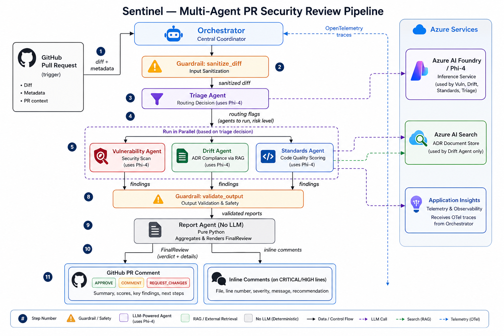

# Sentinel

Automated PR security reviewer. When a pull request opens, Sentinel fetches the diff, routes it through specialist agents, and posts a structured review — flagging hardcoded secrets, SQL injection, architecture violations, and code quality issues before they get merged.

---

## How it works



**Guardrails run on both sides of the model** — `sanitize_diff()` strips prompt injection patterns from the diff before it reaches any agent; `validate_output()` checks responses for logical inconsistencies (e.g. zero findings on a diff containing a secret assignment) and triggers a safe fallback if they fail.

The triage step skips agents that aren't relevant — a docs-only PR never runs a vulnerability scan.

---

## Agents

| Agent | What it does | Output |
|---|---|---|
| **Triage** | Reads diff + metadata, decides which agents to run, sets risk level | `TriageDecision` — routing flags + risk level |
| **Vulnerability** | Scans for hardcoded secrets, SQL/command injection, insecure deps, missing auth | `VulnReport` — per-finding CWE, severity, file, line, fix |
| **Drift** | Retrieves relevant ADRs from Azure AI Search, checks diff for violations | `DriftReport` — violations with ADR reference |
| **Standards** | Scores PR 0–100 on tests, naming, docstrings, error handling, function length | `QualityReport` — score + per-finding suggestions |
| **Report** | Pure Python — merges all reports, determines verdict, formats GitHub comment | `FinalReview` — verdict + action checklist |

Each agent is one `ChatCompletionsClient.complete()` call. The model returns JSON; Pydantic validates it before anything downstream uses it.

---

## Azure services

| Service | Role |
|---|---|
| Azure AI Foundry | Hosts Phi-4, serves inference endpoint |
| Azure AI Search | Stores ADR documents, retrieved per-diff via RAG |
| Application Insights | Receives OpenTelemetry traces — per-agent tokens, findings, verdicts |
| Azure Entra SP | CI identity used by GitHub Actions |

---

## vs GitHub Copilot code review

Copilot is one general-purpose model pass producing prose suggestions. Sentinel is different in three specific ways:

| | Copilot | Sentinel |
|---|---|---|
| **Architectural memory** | None | RAG over your ADR docs — violations traced to specific ADR by name |
| **Specialization** | Single pass | Separate agent per concern — focused prompt, focused output |
| **Output** | Prose comments | Pydantic JSON — severity, CWE, file, line; merge-gateable by severity |
| **Triage** | Same review on every PR | Skips irrelevant agents — docs PR costs one fast triage call |
| **Guardrails** | None | Input sanitized + output validated — safe fallback on failure |
| **Observability** | None | Per-agent token counts in Application Insights via OpenTelemetry |

Copilot is stronger on model quality (fewer false positives) and sees full file context, not diff-only. Sentinel targets the gap: teams with compliance requirements who need ADR enforcement and structured severity-based merge gates.

---

## Benchmark

15 cases extracted from OWASP PyGoat — 10 vulnerable (distinct CWE categories), 5 clean. Each calls the agent directly against a real git diff, no fake PRs.

| Metric | Result |
|---|---|
| Recall | **100%** — 10/10 vulnerable cases caught |
| Precision | **83%** — 10/12 flags were true positives |
| F1 | **0.91** |
| False positive rate | 40% (2/5 clean cases) |
| Triage routing accuracy | **100%** — 5/5 routing decisions correct |
| Avg review time | 4.2s per case |
| Avg tokens / vuln scan | 756 (595 prompt / 160 completion) |
| Avg tokens / triage | 590 (504 prompt / 87 completion) |

CWEs covered: SQL injection ×2 (CWE-89), command injection (CWE-78), eval injection ×2 (CWE-95), path traversal (CWE-22), hardcoded secrets ×2 (CWE-798), bare except (CWE-390), missing auth (CWE-306).

False positives: `subprocess` with arg list flagged as command injection; `os.path.join` with whitelist validation flagged as path traversal. Both are model over-sensitivity to dangerous API presence without data-flow context — a known diff-scope limitation.

Full results: [`benchmark/benchmark_results.json`](benchmark/benchmark_results.json)

---

## Real-world test — OWASP PyGoat

Installed as a composite action on a fork of [OWASP PyGoat](https://github.com/adeyosemanputra/pygoat) (4,000+ stars). Three PRs run end-to-end through GitHub Actions.

| PR | Change | Verdict | Result |
|---|---|---|---|
| 1 | SQL injection in `views.py:159` | REQUEST\_CHANGES · CRITICAL | Caught — exact line flagged, ADR-002 + ADR-003 cited |
| 2 | Clean utility functions | COMMENT · LOW | 0 security findings, quality score 80/100 |
| 3 | README only | COMMENT | Guardrail caught invalid `risk_level: NONE`, safe fallback triggered |

Average review time: ~45–60 seconds per PR (includes GitHub API round-trips).

---

## Setup

### Prerequisites

- Python 3.11+
- Azure account with AI Foundry access and a deployed Phi-4 model
- GitHub fine-grained PAT (pull-requests: read/write, contents: read)
- Azure AI Search service with an index named `sentinel-adrs`
- Application Insights resource (optional)

### Local

```bash
git clone https://github.com/Nisarg01-01/sentinel-pr-review
cd sentinel-pr-review
conda create -n sentinel python=3.11
conda activate sentinel
pip install -r requirements.txt
az login
```

Copy `.env.example` to `.env`:

```
PROJECT_ENDPOINT=https://<resource>.services.ai.azure.com/api/projects/<project>
MODEL=Phi-4-1
GITHUB_TOKEN=<your PAT>
GITHUB_REPO=<owner/repo>
AZURE_SEARCH_ENDPOINT=https://<service>.search.windows.net
AZURE_SEARCH_INDEX=sentinel-adrs
AZURE_SEARCH_KEY=<admin key>
APPLICATIONINSIGHTS_CONNECTION_STRING=<optional>
```

```bash
python setup_search.py          # upload ADRs to search index
python -m src.orchestrator 1 --dry-run   # preview
python -m src.orchestrator 1             # post review
```

### GitHub Actions

Add repository secrets (Settings → Secrets → Actions):

| Secret | Value |
|---|---|
| `AZURE_FOUNDRY_ENDPOINT` | `PROJECT_ENDPOINT` value |
| `AZURE_CLIENT_ID` | Service principal app ID |
| `AZURE_TENANT_ID` | Azure tenant ID |
| `AZURE_CLIENT_SECRET` | Service principal password |
| `SENTINEL_GITHUB_TOKEN` | GitHub PAT |
| `AZURE_SEARCH_ENDPOINT` | Azure AI Search URL |
| `AZURE_SEARCH_KEY` | Azure AI Search admin key |

```bash
az ad sp create-for-rbac \
  --name "sentinel-github-actions" \
  --role "Cognitive Services User" \
  --scopes /subscriptions/<id>/resourceGroups/<rg>
```

Workflow at `.github/workflows/sentinel.yml` triggers on `pull_request` (opened, synchronize, reopened) against `main`/`master`.

---

## Tests

```bash
# Unit tests — no LLM calls (~8s)
conda run -n sentinel pytest tests/test_guardrails.py -v

# Integration tests — calls Phi-4 (~90s)
conda run -n sentinel pytest tests/test_eval.py -v

# Full suite
conda run -n sentinel pytest -v
```

---

## Project structure

```
sentinel-pr-review/
├── src/
│   ├── orchestrator.py        entry point — wires all agents
│   ├── guardrails.py          prompt injection sanitization + output validation
│   ├── telemetry.py           OpenTelemetry → Application Insights
│   ├── models.py              Pydantic models for all agent I/O
│   ├── github_client.py       PR diff fetch, review post, inline comments
│   └── agents/
│       ├── triage_agent.py
│       ├── vuln_agent.py
│       ├── drift_agent.py
│       ├── standards_agent.py
│       └── report_agent.py
├── tests/
│   ├── test_eval.py           integration tests against real model
│   ├── test_guardrails.py     guardrail unit tests
│   └── fixtures/              synthetic .diff files
├── adr_documents/             ADR markdown files → uploaded to Azure AI Search
├── benchmark/
│   ├── run_benchmark.py       precision/recall/F1 evaluation
│   └── benchmark_results.json
├── setup_search.py
├── action.yml                 reusable GitHub Actions composite action
└── .github/workflows/
    └── sentinel.yml
```
